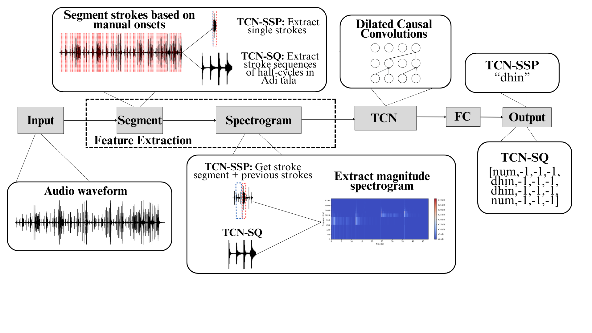
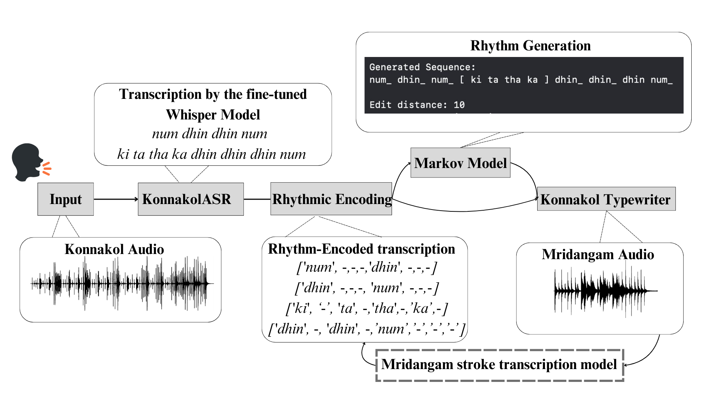
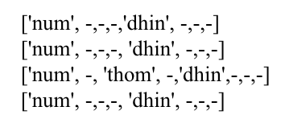

# Mridangam Transcription and Konnakol Sequence Generation

This repository contains the data, results, and pipeline for automatic transcription of **Mridangam** (a South Indian percussion instrument) and **Konnakol** (a vocal percussion language) sequences. Our work involves converting audio recordings of Mridangam and Konnakol into transcriptions of syllables and generating rhythmic sequences based on those transcriptions.

We are building on the [**Konnakol Typewriter**](https://hatimbenhsain.github.io/konnakol%20app/) web application, which converts Konnakol sequences into Mridangam rhythms. Our work expands its functionality by integrating transcription and rhythmic sequence generation tools, and we eventually aim to introduce features like grammar checking and more advanced analysis tools.

This work was carried out at the **Music and Sound Cultures (MASC) research group**, New York University Abu Dhabi, UAE.

## Project Overview

The pipeline includes:
1. **Mridangam Transcription**: Converting audio samples of Mridangam into a transcription of rhythmic syllables.
2. **Konnakol Transcription**: Converting spoken Konnakol sequences into transcriptions of syllables.
3. **Rhythmic Sequence Generation**: Using the transcriptions as input to a Markov model to generate rhythmic sequences.

## Data

### Audio Samples and Transcriptions

| **Mridangam Audio**                         | **Konnakol Audio**                         | **Transcription**                              |
|---------------------------------------------|-------------------------------------------|------------------------------------------------|
| [mridangam_sample_1.wav](data/audio/mridangam_sample_1.wav) | [konnakol_sample_1.wav](data/audio/konnakol_sample_1.wav) | [transcription_1.txt](data/images/tr1.png) |
| Sample 1 for Mridangam transcription         | Sample 1 for Konnakol transcription        | Transcription of Mridangam and Konnakol Sample 1 |
| [mridangam_sample_2.wav](data/audio/mridangam_sample_2.wav) | [konnakol_sample_2.wav](data/audio/konnakol_sample_2.wav) | [transcription_2.txt](data/images/tr2.png) |
| Sample 2 for Mridangam transcription         | Sample 2 for Konnakol transcription        | Transcription of Mridangam and Konnakol Sample 2 |

## Pipeline Diagrams

Below are the pipeline diagrams that illustrate the overall process:

  
*Pipeline diagram illustrating the transcription process for Mridangam.*

  
*Pipeline diagram illustrating the transcription process for Konnakol and rhythmic sequence generation.*

## Results

---

## Konnakol Typewriter Audio vs Original
We compare the original Konnakol audio with the Konnakol Typewriter-generated audio. The results show the performance of our transcription-to-audio pipeline.

### Comparison Table:

| **Konnakol Audio**                 | **Mridangam Audio**                          | **Konnakol Transcription**                  | **Konnakol Typewriter Output**               |
|------------------------------------|---------------------------------------------|---------------------------------------------|---------------------------------------------|
| [konnakol_audio.wav](data/audio/konnakol_original.wav) | [mridangam_audio.wav](data/audio/mridangam_original.wav) |  | [gen_audio.wav](data/audio/typewriter.wav) |
| Konnakol Sample 1 for transcription  | Mridangam Sample 1 corresponding to Konnakol  | Transcription of Konnakol Sample 1           | Typewriter-generated Konnakol Audio for Sample 1 |

## Future Work

Future steps will include:
- Expanding the dataset to improve model performance.
- Refining the transcription models and enhancing rhythmic sequence generation.
- Exploring real-time transcription and synthesis for live performances.
- Grammar Check tool for Konnakol Sequences

